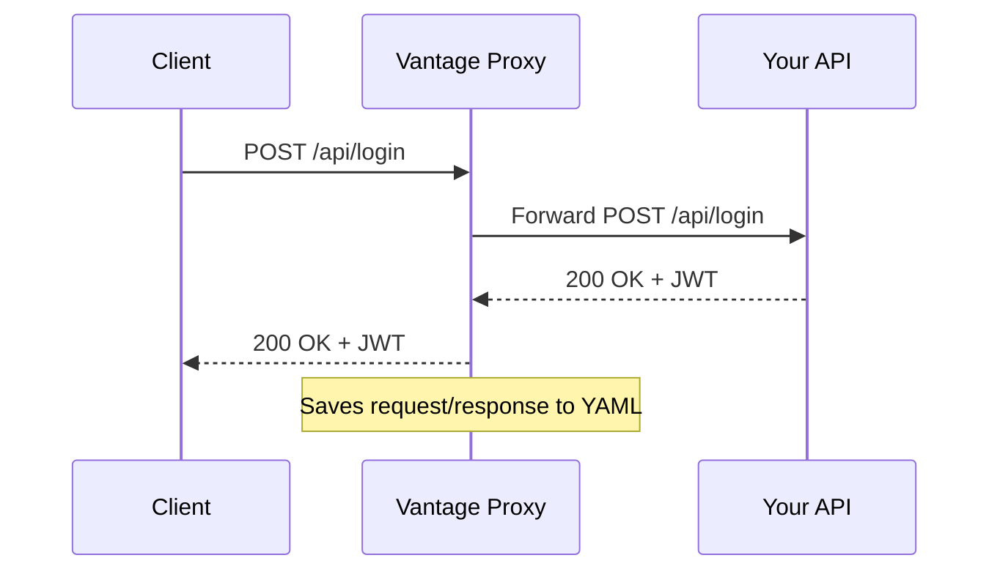

Vantage operates fundamentally as an HTTP interceptor and diffing engine. To properly utilize the tool, it's helpful to understand the underlying architecture and how traffic flows during recording and testing.

## The Recording Flow

During a recording session, Vantage sits between your client (like Postman or a frontend app) and your API server.

1. **Proxy Interception**: By starting `vantage record`, the CLI spins up a lightweight Node.js HTTP server (defaulting to port `6789`).
2. **Forwarding**: You send your traffic to the proxy. If using the Express SDK, the SDK middleware naturally intercepts the Express pipeline. If using Reverse Proxy mode, the proxy blindly forwards packets to your backend port.
3. **Capture & Serialize**: The request headers, method, path, query parameters, body, and the response are converted into a Keploy-style YAML document.
4. **Storage**: The YAML is saved to `.vantage/test-set-N/tests/<slug>.yaml`.

## The Replay Flow

When running `vantage test`, the proxy server is not needed. Instead, the Vantage CLI becomes an HTTP client itself.

1. **Test Ordering**: The engine reads the `.vantage` folder, loading the test sets. Tests are sorted chronologically by their original recording timestamps. This ensures that stateful workflows (e.g., `POST /users` followed by `GET /users`) are executed in the exact correct order.
2. **Sanitization**: Hop-by-hop headers (like `Content-Length`) are stripped from the recorded request so that Axios can recalculate them dynamically.
3. **Execution**: The CLI fires the HTTP requests against your live target application.
4. **Noise Filtering**: Before comparing the expected response to the actual response, the Noise Filter strips out volatile fields configured in `vantage.config.yaml` (and automatically masks standard UUIDs, Dates, and JWTs).
5. **Diffing**: A deep JSON diff is performed on the sanitized bodies, and a strict subset-match is performed on the headers.

## Integration Modes

Vantage offers two ways to capture traffic, depending on your stack.

### 1. Express SDK (Node.js)
If you build in Node.js (Express), you inject a simple middleware `app.use(vantageMiddleware)`. 
- **Pros**: Fastest performance. Runs entirely in the Node process. No extra network hops.
- **Cons**: Only supports Express.js natively.

### 2. Reverse Proxy (Any Language)
If you build in Python, Go, Rust, Ruby, etc., you pass the `--proxy <port>` flag. Vantage acts as a dumb TCP/HTTP proxy, recording the payload as it flies past to your backend.
- **Pros**: Language agnostic. Works with FastAPI, Gin, Rails, etc.
- **Cons**: Requires managing two ports (the proxy port and the app port) during the recording phase.
